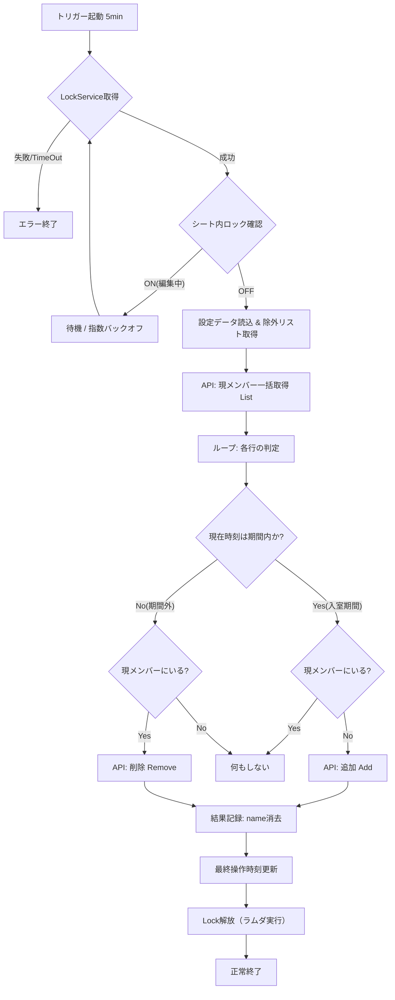

# Google Group Member Sync システム設計書

## 第1部：運用・概念設計 (Intent)

**読者対象**: グループ管理者、運用担当者、システムオーナー
**目的**: 本システムが「何を実現しようとしているか」「どのようなルールで運用されるか」を定義する。

### 1. システムの目的 (Purpose)

本システムは、Google Workspace のグループメンバー管理における「入退室の自動化」と「権限の期限管理」を実現する。
スプレッドシートを「正」とし、Google グループの状態を常にシートの記載通りに保つことで、手動管理によるミス（追加漏れ・削除忘れ）をなくし、管理を効率化することを目的とする。

### 2. 基本原則 (Core Principles)

1.  **シートこそが「正」である (Single Source of Truth)**
    - グループのメンバー構成は、常にスプレッドシートの定義に従属する。
    - API 経由で、グループの状態を自動的にシートの内容と一致させる（Reconciliation）。
2.  **有効期間の自動管理 (Time-Bounded Access)**
    - 設定された「開始時刻」と「終了時刻」の範囲内でのみ、メンバーシップを有効とする。
    - 期間終了後は、システムが自動的に削除を行い、不要な権限の残留を防ぐ。
3.  **管理者は保護する (Safety First)**
    - システム自体の誤動作や設定ミスによる「全削除」事故を防ぐため、特定の管理者（Owner等）はシステムの操作対象外とする。

### 3. 運用ルールと機能

| 項目                   | ルール・意図                                                                                                             |
| :--------------------- | :----------------------------------------------------------------------------------------------------------------------- |
| **メンバー登録**       | 運用者はシートに「Email」「開始日時」「終了日時」を記入するだけでよい。実際の追加・削除はシステムが行う。                |
| **メンテナンスモード** | 緊急時や手動調整を行いたい場合、シート上の「システムロック」セルを有効にする。ロック中はシステムは一切の変更を行わない。 |
| **保護リスト**         | 自分自身や主要な管理者の Email は「操作除外リスト」に登録し、システムによる誤削除を防止する。                            |

---

## 第2部：技術・動作設計 (Behavior)

**読者対象**: スクリプト開発者、保守担当者
**目的**: 第1部の意図を技術的にどう実現するか、具体的な処理ロジックとアーキテクチャを定義する。

### 1. システムアーキテクチャ

- **実行基盤**: Google Apps Script (GAS)
- **使用API**: Cloud Identity Groups API (Advanced Service)
- **実行モデル**: 定期ポーリング型（5分間隔）
  - 個別トリガー方式ではなく、定常的に監視を行い「あるべき姿」との差分（Diff）を解消する方式を採用。これによりトリガー数上限の制約を回避する。

### 2. データフローと同期ロジック

本システムは「命令型（追加しろ/削除しろ）」ではなく、「宣言型（あるべき状態にする）」で動作する。

1.  **期待値の算出 (Desired State)**
    - スプレッドシート（`同期リスト` シート）の時刻設定に基づき、現在この瞬間に「メンバーであるべきユーザー」のリストを生成する。
    - ※ただし、除外リストに含まれるユーザーは計算から除外する。
    - **表示名 (Display Name)**: Cloud Identity Groups API の `Membership` 資源には表示名フィールドが存在しないため、本システムでは「`同期リスト` シートのE列（表示名）」から取得した値を内部的に保持・管理し、API 操作結果の書き戻しに利用する。
2.  **実測値の取得 (Actual State)**
    - Cloud Identity API を使用し、現在のグループメンバー全員を一括取得（Bulk Read）する。
3.  **差分適用 (Reconcile)**
    - **追加**: 「メンバーであるべき」だが「実際にはいない」ユーザー → `Insert`
    - **削除**: 「メンバーであるべきでない」が「実際にはいる」ユーザー → `Delete`
    - **維持**: それ以外は何もしない（API Quota の節約）。

### 3. 排他制御と安全性 (Concurrency & Safety)

競合や予期せぬ動作を防ぐため、以下の2段階のロック機構を実装する。

1.  **ビジネスロジック・ロック (User Lock)**
    - **対象**: `システム設定` シート上の「システムロック」セル
    - **動作**: ON の場合、スクリプトは待機または終了する。編集中のデータ競合を防止するため。
2.  **プロセス・ロック (System Lock)**
    - **対象**: `LockService.getDocumentLock()`
    - **動作**: スクリプトの多重起動を防止する。
    - **設計判断**: 全体への影響を最小限にするため、スクリプト全体（ScriptLock）ではなく、対象のスプレッドシートにスコープを限定した `DocumentLock` を採用。
    - **メリット**: 同一スクリプトプロジェクト内の他の処理や、異なるスプレッドシートを対象とする同期スレッドの並行実行を妨げることなく、対象ドキュメントの整合性のみをピンポイントで保護できるため。
    - **安全性**: 取得時に「解放用ラムダ関数」を生成し、`finally` ブロックで確実に実行することで、デッドロックのリスクを排除する。

### 4. 詳細処理フロー図 (Processing Flow)

### 5. エラーハンドリング要件

- **API エラー**: 一時的な通信エラー以外（403 権限不足など）はログに出力し、その行のみスキップして継続する。
- **データ不整合**: シートに `name` があるが API 上で見つからない（手動削除された）場合は、API の実態（不在）を正として扱い、再追加等の適切な処理を行う。

---

## 第3部：設定仕様 (Configuration)

**読者対象**: システム管理者、導入担当者
**目的**: システムを正しく動作させるために必要な、具体的な設定値と構成を定義する。

### 1. スプレッドシート構成 (Sheet Layout)

システムは以下の2枚のシートを必須とします（いずれかが欠けている場合はエラー終了）。

#### A. `システム設定` シート (Control Sheet)

システム全体の動作を制御・記録するためのシートです。

| アドレス | 項目名         | 役割・設定値                                                                     |
| :------- | :------------- | :------------------------------------------------------------------------------- |
| **B1**   | システムロック | **ON**, **TRUE**, **1** のいずれかが入力されている間、同期処理を完全に停止する。 |
| **B2**   | 最終完了時刻   | 【システム出力】最後に同期処理が正常に完了した日時が記録される。                 |

#### B. `同期リスト` シート (Data Sheet)

メンバーシップの定義を行うシートです。データは **2行目** から開始されます（1行目はヘッダー行）。

| 列      | 項目名        | 内容・書式                                                            |
| :------ | :------------ | :-------------------------------------------------------------------- |
| **A列** | グループEmail | 同期対象となる Google グループのメールアドレス。                      |
| **B列** | メンバーEmail | 追加・削除対象となるユーザーのメールアドレス。                        |
| **C列** | 開始日時      | メンバーシップを有効にする開始日時。日付または日時形式。              |
| **D列** | 終了日時      | メンバーシップを無効にする終了日時。日付または日時形式。              |
| **E列** | 表示名        | 【システム出力】同期成功時に API から取得した名前を書き戻す（任意）。 |

### 2. スクリプトプロパティ (Script Properties)

Google Apps Script の「プロジェクトの設定 > スクリプトプロパティ」に設定する環境変数。

| キー名             | 役割           | 設定値の例                                                                                                                                 |
| :----------------- | :------------- | :----------------------------------------------------------------------------------------------------------------------------------------- |
| **EXCLUDED_USERS** | 操作除外リスト | `admin@example.com,owner@example.com`   カンマ区切りで指定されたアドレスは、システムによる自動追加・削除の対象から完全に除外される。 |
